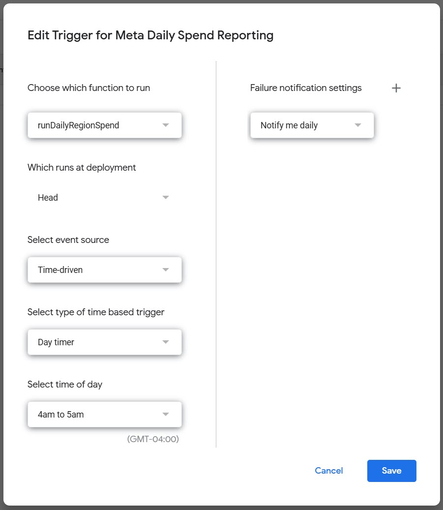

# Meta Ads Daily Spend by Region to Google Sheets
Pulls daily spend by *region* for multiple Meta Ads accounts and adds to a Google Sheet. Perfect tor those looking to automate spend reporting by region. 

This script sits inside a Google Sheet and is intended to run daily. The default setting is to look back and update the previous 3 days (excluding today) from multiple Meta Ads accounts. 

### Region-level report
The level of regional breakdown available depends on the specific targeting options used in your ad campaigns and the data available through the API. A region is something like a US State in Meta Ads Reports. A typical example of this is if you're targeting the US: regions are states. In Canada, regions are provinces. 

### Important Note
This script requires only works if you have a [Meta App created through Facebook Developers](https://developers.facebook.com/). It connects to the [Marketing API](https://developers.facebook.com/docs/marketing-api/) through an Access Token that you will need to create. Luckily anyone should be able to create their own Meta App as it is a simple multi-step process.

## Instructions
1) Create (or open) a Google Sheet, create a new tab and name it: Meta Daily Region Spend
2) Open Google Apps Script:
   - Extensions → Apps Script → New project
4) Paste this script and modify the script settings:
   - ACCESS_TOKEN: Meta Marketing API token with `ads_read` for all accounts.
   - API_VERSION: Graph API version (e.g., v23.0).
   - ALLOW_ACCOUNT_IDS: list of ad accounts to include (e.g., ['act_123...', ...]).
   - DAYS_BACK: how many days back (excluding today) to fetch/upsert.
   - SHEET_NAME / TIMEZONE and other options as needed.
5) Entry point: runDailyRegionSpend()
   - Use Triggers → Add Trigger → Head: runDailyRegionSpend → Time‑driven (e.g., daily).
6) Authorize and run once to create headers; verify the tab shows upserts (no dupes).

**You do not need to deploy the script - just make sure the trigger is set properly**

Access the Script trigger in the script area on the left hand menu. Below is the screenshot of how the trigger.

## Intended Use
This Meta Ads / Google Sheet script is a simple tool to track region-level spend on a daily basis.
It is great for those importing daily spends from multiple ad platforms into a single Google Sheet.
This is ideal for teams working with multiple Meta Ads accounts whether in an agency or in-house.

## Author
[Sam Lalonde](https://www.linkedin.com/in/samlalonde/)  
---

## License
This project is licensed under the [MIT License](https://opensource.org/licenses/MIT).  
Free to use, modify, and distribute.
